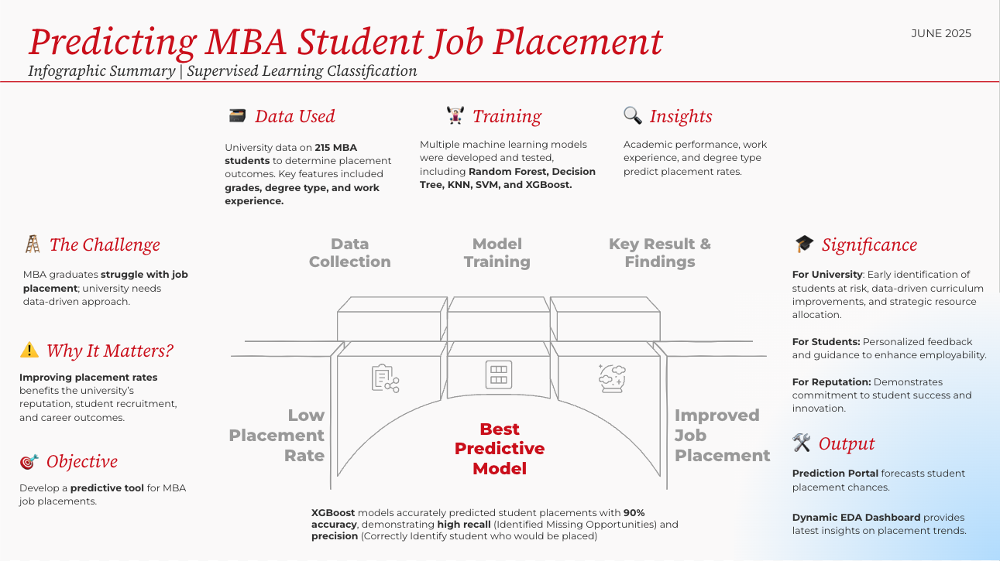

# 🎓 MBA Student Placement Prediction

Hi, I’m Syarief! Welcome to my MBA Student Placement Prediction project—a hands-on journey where I combined my passion for data science with the real-world challenge of helping MBA students land their dream jobs.

---

## 🌟 Why I Built This

- Saw a gap: Many universities struggle to understand what truly drives student placement success.
- Wanted to help: I aimed to give career advisors and students actionable insights with data-driven predictions.
- Personal drive: As someone who values education and opportunity, I wanted to make a tangible impact using machine learning.

---

## 🚀 What’s in This Project

- **End-to-End ML Pipeline:** From exploring raw data to deploying a working model, I handled every step.
- **Interactive Web App:** Built with Streamlit and deployed on HuggingFace to make predictions accessible and user-friendly.
- **Comprehensive Analysis:** Dug deep into the data to uncover what factors really matter for placement.

---

## 🧑‍💻 My Contributions & Technical Highlights

- **Data Exploration & Visualization:** Used pandas, matplotlib, and seaborn to understand trends and spot insights.
- **Model Development:** Trained and tuned an XGBoost classifier for robust predictions.
- **Deployment:** Created a Streamlit app and packaged the model for real-time use.
- **Collaboration & Documentation:** Wrote clear guides and code comments to make the project easy for others to follow.

---

## 🏆 What I Learned & Challenges Overcome

- **Balanced Data Handling:** Navigated imbalanced placement outcomes to ensure fair predictions.
- **Feature Engineering:** Transformed raw academic and demographic data into meaningful model inputs.
- **Model Tuning:** Experimented with parameters to boost performance and avoid overfitting.
- **Deployment Hurdles:** Troubleshot web app integration and cloud deployment—learned a ton!

---

## 📊 The Dataset

- **Source:** Kaggle (Campus Recruitment Dataset)
- **Size:** 215 students, 14 features
- **Features:** Academic scores, demographics, prior work experience, placement status, and salary

---

## 🛠️ Tools & Frameworks

- Python (pandas, numpy, matplotlib, seaborn)
- XGBoost
- Streamlit
- scikit-learn

---

## 🤝 Let’s Connect!

I love collaborating with curious minds and tackling new challenges. If you’re passionate about data, business, or tech—or you just want to chat about ideas—reach out!

- [GitHub](https://github.com/syariefsq)
- [LinkedIn](https://www.linkedin.com/in/syariefqayum/)
- [Email](mailto:syarif.qayyum@gmail.com)

